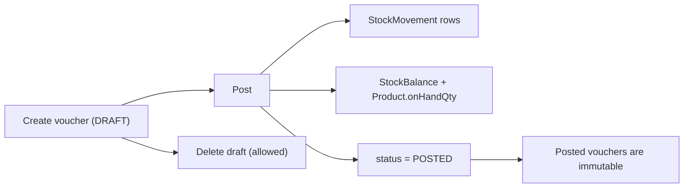
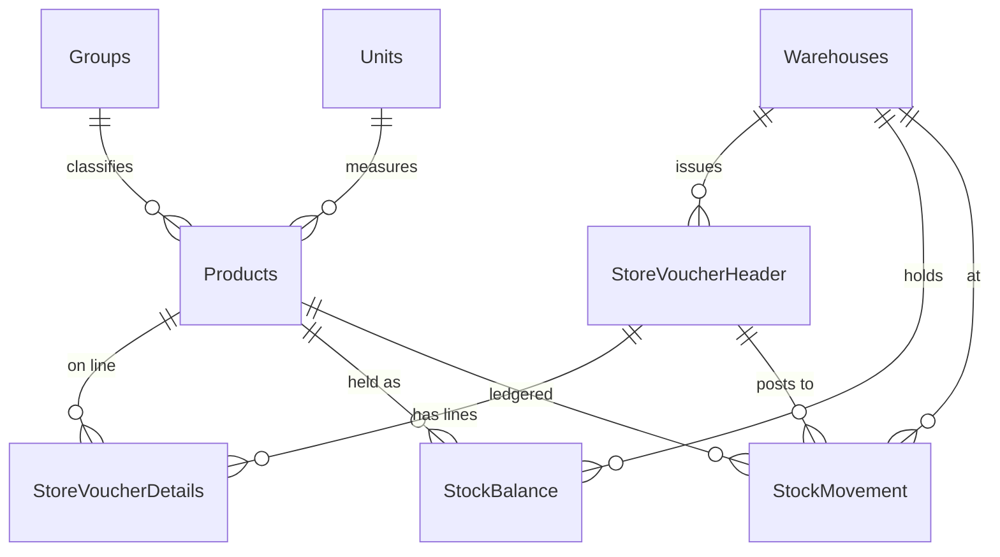

# Mini Inventory System

A multi-warehouse inventory system built around **store vouchers**. Stock is never edited
directly: every change is a document (`SVI` in, `SVO` out) that starts as a draft and only
affects stock when it is **posted**. Posting writes an immutable ledger row, updates the
warehouse balance and the product total inside a single database transaction.

Built with Next.js (App Router, TypeScript), PostgreSQL and Prisma.

---

## Quick start

Requirements: Node.js 20+ and Docker.

```bash
# 1. Start PostgreSQL (host port 5433, so it will not clash with a local install)
docker compose up -d

# 2. Install dependencies (also generates the Prisma client)
npm install

# 3. Point the app at the database
cp .env.example .env        # Windows: copy .env.example .env

# 4. Create the schema and load sample data
npm run db:migrate
npm run db:seed

# 5. Run it
npm run dev
```

Open <http://localhost:3000>.

The seed creates 3 groups, 3 units, 3 warehouses (`MAIN`, `NORTH`, `SOUTH`) and 3 products,
all starting at **zero stock**. Use *Add Stock* on the products page to bring stock in.

### Verifying it works

With the dev server running:

```bash
npm run smoke
```

This drives the REST API end to end and asserts the behaviour that matters: drafts do not
move stock, weighted average costing, over-issuing is refused, a transfer updates both
warehouses, and a failed transfer leaves **both** sides untouched. It creates its own
product, so it is safe to re-run at any time.

### Scripts

| Script | Purpose |
| --- | --- |
| `npm run dev` | Start the app |
| `npm run build` | Production build |
| `npm run db:up` / `db:down` | Start / stop PostgreSQL |
| `npm run db:migrate` | Apply migrations (development) |
| `npm run db:deploy` | Apply migrations (production) |
| `npm run db:seed` | Load sample master data |
| `npm run db:studio` | Browse the database in Prisma Studio |
| `npm run smoke` | End-to-end API check |

> `npm run db:reset` drops and recreates the database. It destroys all data, so only run it
> against your local development database.

---

## How it works

### Document flow



- **Add stock** creates one `SVI_xxxx` voucher (`type = 1`).
- **Remove stock** creates one `SVO_xxxx` voucher (`type = 2`).
- **Transfer** creates **two** vouchers sharing a `transferRef` (`SVT_xxxx`): an `SVO` on the
  source warehouse and an `SVI` on the destination. Posting either one posts both inside the
  same transaction, so the two warehouses can never move independently.

### Data model



| Table | Role |
| --- | --- |
| `Groups`, `Units` | Product classification and unit of measure |
| `Products` | `sku`, `nameEn`, `nameAr`, `unitId`, `groupId`, `unitCost`, `onHandQty` |
| `Warehouses` | `store` (short code) and `name` |
| `StoreVoucherHeader` | `txNo` (PK), `storeId`, `type`, `date`, `status`, `transferRef`, `insertUid`, `postedUid` |
| `StoreVoucherDetails` | `txNo`, `productId`, `qty`, `unitCost`, `lineTotal`, `trnsDate` |
| `StockMovement` | The ledger: `ref`, `productId`, `storeId`, **signed** `qty`, `cost` |
| `StockBalance` | Derived quantity and average cost per product per warehouse |
| `NumberSequence` | Gapless document numbering per prefix |

The schema lives in [prisma/schema.prisma](prisma/schema.prisma) and the SQL migration in
[prisma/migrations](prisma/migrations).

### Transactions

All posting logic is in [src/server/posting-service.ts](src/server/posting-service.ts),
wrapped in a single `prisma.$transaction`. Three things make it safe under concurrency:

**1. Balances are locked up front, in a stable order.** Every balance row the posting will
touch is created if missing (`INSERT ... ON CONFLICT DO NOTHING`, so concurrent creators
cannot collide) and then locked with `SELECT ... FOR UPDATE`. Locking in a deterministic
order keeps two simultaneous transfers between the same pair of warehouses from deadlocking
against each other.

**2. The stock check lives inside the write.** Rather than reading a quantity and then
updating it, the condition is part of the `WHERE` clause, so the check and the decrement are
one statement and stock cannot be driven negative:

```ts
const result = await tx.stockBalance.updateMany({
  where: { productId, storeId, qty: { gte: line.qty } },
  data: { qty: { decrement: line.qty } },
});
if (result.count === 0) throw new InsufficientStockError(...);
```

**3. Both legs of a transfer post together.** The outbound leg is applied first so the
inbound leg can be valued at the cost the goods actually left at. If any line of either leg
fails, the whole transaction rolls back and neither warehouse changes.

### Costing

Stock is valued at a **weighted moving average per product per warehouse**:

- Receiving blends the incoming cost into the average:
  `(oldQty x oldAvg + inQty x inCost) / (oldQty + inQty)`
- Issuing is valued at the current average, which leaves the average unchanged.
- A transfer's inbound leg inherits the source warehouse's average cost, so inventory value
  travels with the goods.

---

## REST API

All errors share the shape `{ "error": { "code", "message", "details"? } }` with
`400` validation, `404` not found, and `409` insufficient stock or illegal state.

### Master data

| Method | Path | Description |
| --- | --- | --- |
| `GET` `POST` | `/api/groups` | List / create groups |
| `GET` `POST` | `/api/units` | List / create units |
| `GET` `POST` | `/api/warehouses` | List / create warehouses |
| `GET` `POST` | `/api/products` | List / create products |
| `GET` | `/api/products/[id]/balances` | Quantity and average cost per warehouse |

### Vouchers and stock

| Method | Path | Description |
| --- | --- | --- |
| `GET` | `/api/vouchers?status=&storeId=&type=` | List vouchers |
| `POST` | `/api/vouchers` | Create a draft voucher |
| `GET` | `/api/vouchers/[txNo]` | One voucher with its lines |
| `DELETE` | `/api/vouchers/[txNo]` | Delete a draft (posted vouchers are refused) |
| `POST` | `/api/vouchers/[txNo]/post` | Post it (posts both legs if it is a transfer) |
| `POST` | `/api/transfers` | Create a linked draft transfer pair |
| `POST` | `/api/transfers/[ref]/post` | Post both legs atomically |
| `GET` | `/api/movements?productId=&storeId=&limit=` | The stock ledger |

### Examples

Add stock:

```bash
curl -X POST http://localhost:3000/api/vouchers \
  -H "Content-Type: application/json" \
  -d '{"storeId":1,"type":1,"lines":[{"productId":1,"qty":100,"unitCost":50}]}'

curl -X POST http://localhost:3000/api/vouchers/SVI_0001/post
```

Transfer stock:

```bash
curl -X POST http://localhost:3000/api/transfers \
  -H "Content-Type: application/json" \
  -d '{"fromStoreId":1,"toStoreId":2,"lines":[{"productId":1,"qty":25}]}'

curl -X POST http://localhost:3000/api/transfers/SVT_0001/post
```

---

## Screens

| Page | What it does |
| --- | --- |
| `/` | Product list; expand a row to see quantity and average cost per warehouse, with **Add**, **Remove** and **Transfer** on each warehouse |
| `/vouchers` | All vouchers with a status filter; expand to see lines, **Post** or **Delete** a draft |
| `/movements` | The stock ledger, filterable by product and warehouse |
| `/setup` | Create products, warehouses, groups and units |

Every stock dialog offers **Save as Draft** or **Save and Post**.

---

## Design decisions and assumptions

**Vouchers as the only way to change stock.** There is no endpoint that writes a quantity
directly. This is what makes the system auditable: for any balance you can point at the
documents that produced it.

**`StockBalance` is a cache, the ledger is the truth.** The original design had no
per-warehouse quantity table, but the UI needs one and, more importantly, a real row is what
PostgreSQL can lock to keep concurrent postings from overselling. It is exactly
`SUM(StockMovement.qty) GROUP BY productId, storeId` and can be rebuilt from the ledger at
any time. `Products.onHandQty` is the same idea at the product level.

**Signed quantities in the ledger.** Outbound rows are negative, matching the original
design notes, so a balance is a plain `SUM` with no need to branch on the voucher type.

**Transfers are two vouchers, not a new document type.** This keeps the header shape
unchanged (one warehouse, one direction) and means a transfer shows up correctly in each
warehouse's own document history. The `transferRef` ties them together.

**Posted vouchers are immutable.** There is no edit or delete once posted; a correction is
made by posting an opposite voucher. Drafts can be freely deleted, and deleting one leg of a
draft transfer deletes both so no orphan is left behind.

**Document numbers are gapless.** `NumberSequence` is incremented under a row lock held by
the creating transaction, so a rollback returns the number rather than burning it. The
trade-off is that voucher creation serialises per prefix, which is acceptable at this scale.

**Integer quantities.** Costs are `DECIMAL(18,4)`, but quantities are whole numbers; there
are no fractional units.

**Authentication is out of scope**, so `insertUid` and `postedUid` record a fixed `system`
user. The columns exist so real users can be dropped in later without a migration.

**`type` is stored as an integer** (`1` = in, `2` = out) to stay faithful to the original
design, with named constants in [src/lib/constants.ts](src/lib/constants.ts) rather than
raw numbers scattered through the code.

**Known limitation.** Two reciprocal transfers posting at the exact same moment can still
deadlock in PostgreSQL despite the ordered locking. One transaction is aborted and the API
returns `409` with a retryable message rather than corrupting anything.

---

## Project layout

```
prisma/
  schema.prisma          Data model
  migrations/            SQL migrations
  seed.ts                Sample master data
src/
  app/
    api/                 REST route handlers
    page.tsx             Products and stock
    vouchers/            Voucher list and posting
    movements/           Stock ledger
    setup/               Master data forms
  server/
    posting-service.ts   The transactional posting engine
    voucher-service.ts   Draft creation, transfers, numbering
    sequence.ts          Gapless document numbers
  lib/                   Prisma client, validation, errors, API helpers
  components/            UI
scripts/
  smoke-test.mjs         End-to-end API check
```
